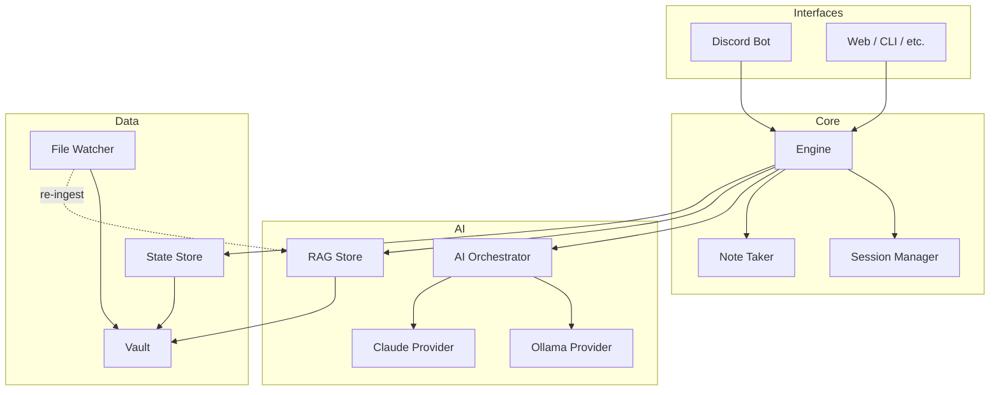
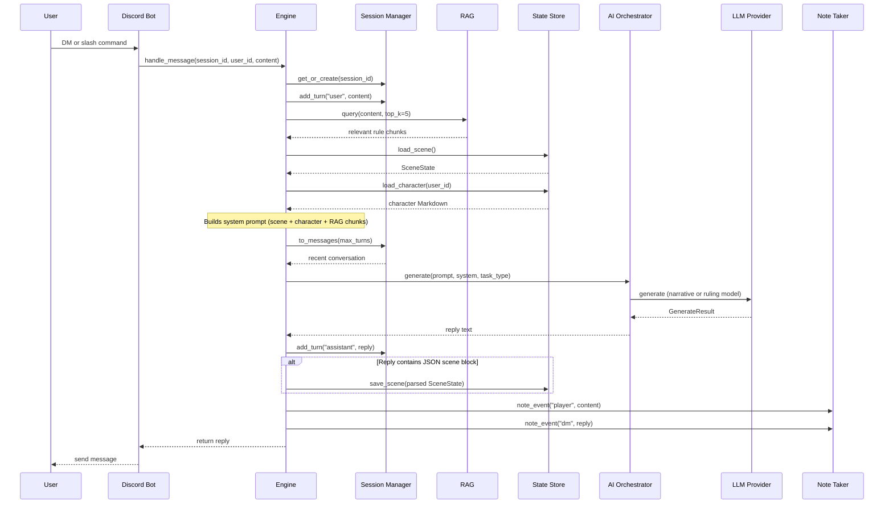
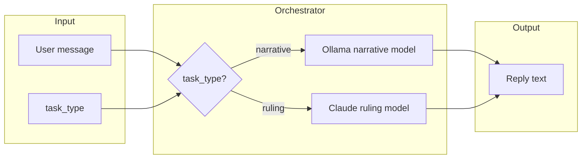
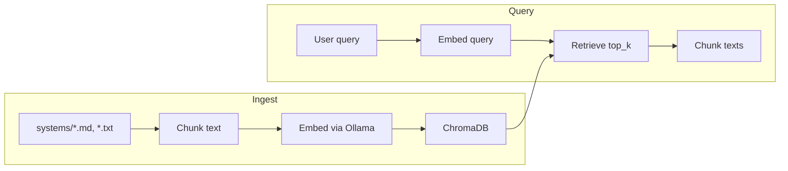
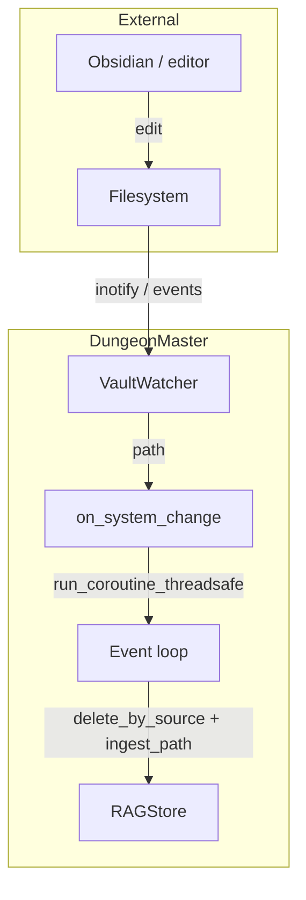
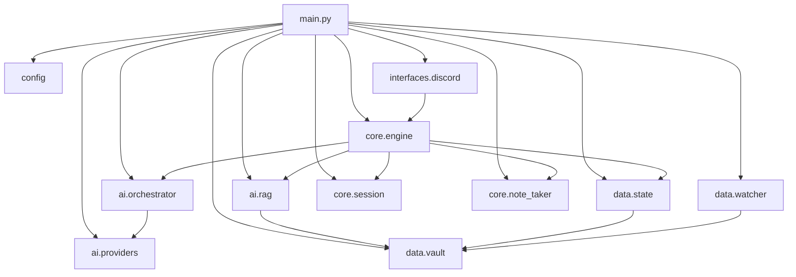

# DungeonMaster Architecture

This document describes the high-level architecture, component responsibilities, and main data and message flows.

## Design Principles

- **One instance, one campaign** — A single DungeonMaster process serves one campaign. Players interact via private channels (e.g. Discord DMs).
- **Interface-agnostic core** — The engine exposes a single message-handling API; Discord and future UIs are adapters.
- **System-agnostic AI** — Rules and lore come from ingested documents (RAG); no game system is hardcoded.
- **Obsidian-friendly vault** — All persistent content lives in a directory layout you can open in Obsidian.

---

## System Overview

| Layer | Responsibility |
|-------|----------------|
| **Interfaces** | Translate platform events (e.g. Discord DM) into `(session_id, user_id, content)` and send replies back. |
| **Core** | Engine orchestrates each message: session history, RAG/state context, AI call, scene/notes updates. Session Manager holds in-memory conversation; Note Taker appends to vault Markdown. |
| **AI** | Orchestrator routes by task type (narrative vs ruling). RAG retrieves relevant rule chunks from ChromaDB. Providers (Ollama, Claude) perform completion and embeddings. |
| **Data** | Vault is the single root for all paths. State Store reads/writes scene JSON and character/NPC Markdown. File Watcher triggers re-ingest or refresh on vault changes. |

---

## Message Flow (Request to Response)

When a player sends a message (e.g. via Discord DM), the following flow runs:

---

## AI Task Routing

The orchestrator chooses which provider (and thus which model) to use based on `task_type`:

- **narrative** — Flavor text, descriptions, in-world response. Typically a faster/cheaper model (e.g. Ollama).
- **ruling** — Rules questions, planning, adjudication. Typically a stronger model (e.g. Claude).

Slash commands map as follows: `/action`, `/say`, and plain DM text use narrative; `/status`, `/notes` use ruling.

---

## RAG Pipeline

Rulebooks and source documents in the vault are chunked, embedded, and stored for retrieval:

- **Ingest**: `VaultWatcher` or startup triggers `RAGStore.ingest_path` / `ingest_all`. Text is split with a sliding window (chunk_size, overlap), embedded with the configured embedding model, and upserted into ChromaDB (persisted under `vault/_index/chroma`).
- **Query**: On each `handle_message`, the engine calls `RAGStore.query(message_content, top_k=5)`. Retrieved chunks are injected into the system prompt so the model can cite rules without hardcoding.

---

## File Watcher and Re-ingestion

- **systems/** — A change (create/edit/delete) triggers re-ingestion for that path: existing chunks from that source are removed, then the file is re-chunked and re-embedded.
- **characters/**, **npcs/** — Changes can be wired to refresh in-memory state or notify the engine (e.g. "character sheet updated"); the current implementation focuses on system re-ingest.

---

## Component Dependencies (Simplified)

---

## Concurrency and Threading

- **Main thread** runs the asyncio event loop: Discord bot, engine `handle_message`, RAG query/ingest, orchestrator.
- **Watcher** runs in a background thread (watchdog `Observer`). When a file changes, it invokes a sync callback; the callback uses `asyncio.run_coroutine_threadsafe(reingest(), loop)` to schedule async re-ingest on the main loop.

---

## Related Documentation

- [Vault and state](VAULT_AND_STATE.md) — Directory layout, scene JSON schema, character/NPC Markdown.
- [README](../README.md) — Quick start, configuration, Docker.
