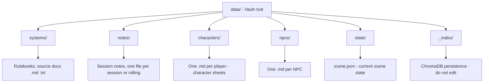
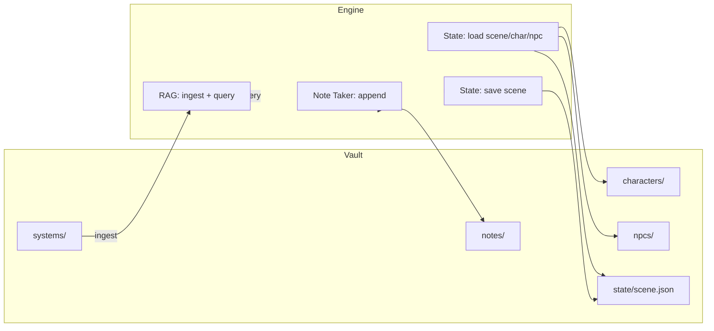

# Vault Layout and State

DungeonMaster uses a single **vault** directory for all persistent content. The layout is chosen so you can open the same folder in **Obsidian** and edit or view everything the DM uses. One instance = one campaign = one vault root.

## Vault Directory Layout



| Path | Purpose | Format | Obsidian |
|------|---------|--------|----------|
| `systems/` | Rulebooks, source material to ingest into RAG | Markdown, TXT | Yes — add/edit files here; changes trigger re-ingest |
| `notes/` | Session notes produced by the Note Taker | Markdown | Yes — view/edit session logs |
| `characters/` | One file per player (e.g. Discord user ID) | Markdown | Yes — character sheets |
| `npcs/` | One file per NPC | Markdown | Yes — NPC roster |
| `state/` | Current scene (who/what/where) | JSON | Optional — mainly for VTT/frontend sync |
| `_index/` | ChromaDB vector DB files | Internal | No — do not edit |

## Path Conventions

- **Character files**: `characters/<sanitized_player_id>.md`. The player ID (e.g. Discord user ID) is sanitized to alphanumeric, `-`, and `_`.
- **NPC files**: `npcs/<sanitized_npc_id>.md`.
- **Notes**: `notes/<note_id>.md`. The default note ID is session-based (e.g. `session-YYYYMMDD`).
- **Scene**: Exactly `state/scene.json`.

## Scene State (JSON)

The file `state/scene.json` holds the current scene for VTT/frontend sync and for the AI’s context. The engine loads it on each message and may overwrite it when the model returns a structured scene update in a fenced JSON block.

### Schema (logical)

```json
{
  "scene_id": "string - identifier for the scene",
  "location": {
    "name": "string - e.g. Tavern",
    "description": "string - short description"
  },
  "positions": [
    {
      "entity_id": "string",
      "entity_type": "player | npc | object",
      "x": 0.0,
      "y": 0.0,
      "zone": "string - optional zone name"
    }
  ],
  "turn_order": ["entity_id", "..."],
  "timestamp": "ISO8601 string"
}
```

### Example

```json
{
  "scene_id": "tavern-1",
  "location": {
    "name": "The Rusty Dagger",
    "description": "A noisy tavern. The bar is to the north."
  },
  "positions": [
    {
      "entity_id": "player_123",
      "entity_type": "player",
      "x": 10,
      "y": 5,
      "zone": "main_room"
    },
    {
      "entity_id": "barkeep",
      "entity_type": "npc",
      "x": 15,
      "y": 10,
      "zone": "bar"
    }
  ],
  "turn_order": ["player_123", "barkeep"],
  "timestamp": "2025-02-14T12:00:00Z"
}
```

### How scene updates work

1. The engine includes the current `scene.json` (or a default) in the system prompt.
2. The model may respond with a fenced block: ` ```json ... ``` `.
3. The engine parses that block; if valid, it replaces `state/scene.json` with the new structure. This allows the DM to “move” entities or change location in one reply.

## Character and NPC Markdown

Character and NPC files are free-form Markdown. The engine loads the raw text and injects it into the system prompt (e.g. “Player character sheet: …”). No fixed schema is required; you can use headings, lists, or blocks as you like. Editing these files in Obsidian is supported; the file watcher can be extended to react to changes (e.g. refresh in-memory state).

## Data Flow (Vault ↔ Engine)



- **Read on each message**: Scene, current player’s character, and (if needed) NPCs are read from the vault via `StateStore`.
- **Write on each message**: Note Taker appends to a note file; optionally the engine writes an updated `scene.json` when the model returns a scene block.
- **RAG**: Reads from `systems/` during ingest; query is in-memory (ChromaDB) plus disk in `_index/`.

See [ARCHITECTURE.md](ARCHITECTURE.md) for full request/response flow.
